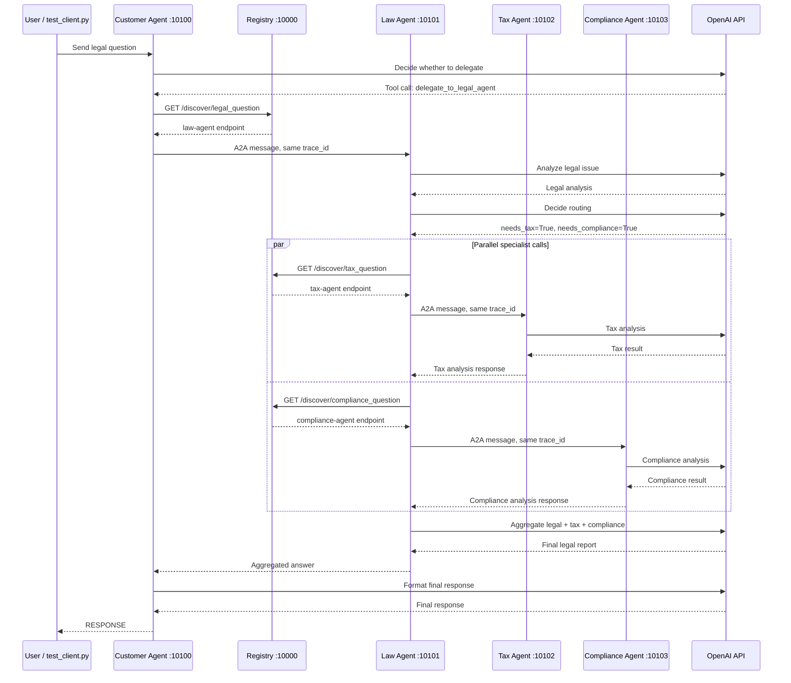

# Codelab: Xây Dựng Hệ Thống Multi-Agent với A2A Protocol

**Thời gian:** 2 giờ  
**Ngôn ngữ:** Python 3.11+  
**Công nghệ:** LangGraph, LangChain, A2A SDK

## Mục Tiêu Học Tập

Sau khi hoàn thành codelab này, bạn sẽ:
- Hiểu cách LLM hoạt động từ cơ bản đến nâng cao
- Biết cách tích hợp tools và RAG vào LLM
- Xây dựng được single agent với ReAct pattern
- Tạo multi-agent system với LangGraph
- Triển khai distributed agents với A2A protocol

## Chuẩn Bị

### Yêu Cầu Hệ Thống
- Python 3.11 trở lên
- [uv](https://docs.astral.sh/uv/) package manager
- API key (OpenAI hoặc Google Gemini)

### Cài Đặt

```bash
# Clone repository
git clone <repo-url>
cd legal_multiagent

# Cài đặt dependencies
uv sync

# Cấu hình environment
cp .env.example .env
# Sửa file .env, thêm OPENAI_API_KEY hoặc GOOGLE_API_KEY của bạn
```

---

## Phần 1: Direct LLM Calling (20 phút)

### Lý Thuyết

LLM (Large Language Model) ở dạng cơ bản nhất là một API nhận input text và trả về output text. Không có memory, không có tools, chỉ dựa vào training data.

**Ưu điểm:**
- Đơn giản, dễ implement
- Phản hồi nhanh

**Nhược điểm:**
- Không có kiến thức real-time
- Không thể tra cứu database
- Không có context giữa các lần gọi

### Thực Hành

**Bước 1:** Chạy demo Stage 1

```bash
uv run python stages/stage_1_direct_llm/main.py
```

### 📋 Output Stage 1

```
======================================================================
STAGE 1: Direct LLM Calling
======================================================================

[How it works]
  1. We send a system prompt + user question directly to the LLM
  2. The LLM responds from its training data only
  3. No tools, no retrieval, no external knowledge

Question: What are the legal consequences if a company breaches a
          non-disclosure agreement?
----------------------------------------------------------------------

>>> Calling LLM directly (no tools, no RAG)...

When a company breaches a non-disclosure agreement (NDA), several legal
consequences may arise:

1. **Damages**: Monetary damages — direct, consequential, and sometimes
   punitive damages if the breach was willful.

2. **Injunctions**: Court order to prevent further disclosure.

3. **Specific Performance**: Compelling the breaching party to comply
   with NDA terms.

4. **Legal Fees**: Many NDAs allow the prevailing party to recover
   attorney's fees.

5. **Reputational Damage**: Harm to business relationships and future
   opportunities.

6. **Criminal Liability**: Under the Defend Trade Secrets Act (DTSA)
   criminal charges may apply.

----------------------------------------------------------------------
[Limitations of Stage 1]
  - Stateless: no conversation memory between calls
  - No tools: cannot search databases or calculate damages
  - Knowledge cutoff: only knows what was in training data
  - No grounding: cannot cite specific statutes or current case law
======================================================================
```

**Bước 2:** Đọc và hiểu code

Mở file `stages/stage_1_direct_llm/main.py` và trả lời:

1. LLM được khởi tạo như thế nào? (Tìm hàm `get_llm()`)
2. Message được gửi đến LLM có cấu trúc gì?
3. Tại sao cần có `SystemMessage` và `HumanMessage`?

**Trả lời:**

1. `get_llm()` trong `common/llm.py` khởi tạo `ChatOpenAI` với model `gpt-4o-mini`, đọc API key từ biến môi trường `OPENAI_API_KEY`.
2. Message là một list gồm `SystemMessage` (định nghĩa role/persona cho LLM) và `HumanMessage` (câu hỏi thực tế của người dùng).
3. `SystemMessage` thiết lập ngữ cảnh — ví dụ *"You are a legal expert..."* — giúp LLM hiểu vai trò cần đảm nhận. `HumanMessage` là câu hỏi cụ thể. Tách hai loại này giúp LLM phân biệt rõ hướng dẫn hệ thống và yêu cầu của người dùng.

**Bài Tập 1.1:** Thay đổi câu hỏi

Sửa biến `QUESTION` thành câu hỏi pháp lý khác (tiếng Việt hoặc tiếng Anh) và chạy lại.

**Kết quả đã chạy:**

```bash
uv run python stages/stage_1_direct_llm/main.py
```

**Câu hỏi mới:**

```text
What legal risks arise if an employer terminates an employee without proper notice?
```

**Output chính:**

```text
The LLM trả lời trực tiếp về các rủi ro:
- Breach of contract nếu hợp đồng yêu cầu notice period.
- Wrongful termination nếu termination liên quan retaliation,
  discrimination, hoặc violation of public policy.
- Unemployment claims và ảnh hưởng đến chi phí bảo hiểm thất nghiệp.
- Reputational damage và ảnh hưởng morale nội bộ.
```

**Đánh giá:** Stage 1 chạy đúng với câu hỏi mới, chỉ dùng direct LLM call, không dùng tools/RAG/memory.

**Bài Tập 1.2:** Thêm temperature control

Thêm parameter `temperature=0.3` vào hàm `get_llm()` trong `common/llm.py` để làm output ổn định hơn.

---

## Phần 2: LLM + RAG & Tools (30 phút)

### Lý Thuyết

**RAG (Retrieval-Augmented Generation):** Cho phép LLM tra cứu knowledge base trước khi trả lời.

**Tools:** Các function mà LLM có thể gọi để thực hiện tác vụ cụ thể (tính toán, query database, gọi API).

**Function Calling Flow:**
1. LLM nhận câu hỏi + danh sách tools
2. LLM quyết định gọi tool nào (hoặc không gọi)
3. Tool được execute, trả về kết quả
4. LLM nhận kết quả và tạo câu trả lời cuối cùng

### Thực Hành

**Bước 1:** Chạy demo Stage 2

```bash
uv run python stages/stage_2_rag_tools/main.py
```

### 📋 Output Stage 2

```
======================================================================
STAGE 2: LLM + RAG / Tools
======================================================================

Question: What are the legal consequences if a company breaches a
          non-disclosure agreement?
----------------------------------------------------------------------

>>> Step 1: Asking LLM (with tools bound)...

>>> Step 2: LLM requested 1 tool call(s):

  Tool: search_legal_database
  Args: {'query': 'legal consequences breach non-disclosure agreement'}
  Result: [nda_trade_secret] NDA breaches may trigger both contractual
  and statutory liability. Under the Defend Trade Secrets Act (DTSA,
  18 U.S.C. § 1836)...

>>> Step 3: LLM generating final answer with tool results...

When a company breaches an NDA, consequences include:

1. **Contractual Remedies** (UCC Article 2):
   - Expectation damages, Consequential damages (Hadley v. Baxendale 1854)
   - Specific performance, Cover damages

2. **Statutory Remedies** (DTSA, 18 U.S.C. § 1836):
   - Injunctive relief
   - Actual damages + unjust enrichment
   - Exemplary damages up to 2× for willful breach
   - Attorney's fees

3. **Criminal Liability** (Economic Espionage Act, 18 U.S.C. § 1832):
   - Up to $5M fine for individuals

----------------------------------------------------------------------
[Improvements over Stage 1]
  + Grounded: answers cite specific statutes (DTSA, UCC, etc.)
  + Tool use: can search databases and calculate damages
  + More accurate: retrieval reduces hallucination risk

[Limitations of Stage 2]
  - Manual orchestration: we wrote the tool-call loop ourselves
  - Single pass: only one round of tool calls
  - No reasoning loop: LLM can't decide to search again if needed
======================================================================
```

**Bước 2:** Phân tích code

Mở `stages/stage_2_rag_tools/main.py` và tìm:

1. Hàm `@tool` decorator được dùng ở đâu?
2. `LEGAL_KNOWLEDGE` được cấu trúc như thế nào?
3. LLM được bind với tools ra sao? (Tìm `.bind_tools()`)

**Trả lời:**

1. `@tool` decorator được dùng tại `search_legal_database` (line 91) và `calculate_damages` (line 110) — chuyển Python function thành LangChain tool với tên và docstring tự động.
2. `LEGAL_KNOWLEDGE` là một list các dict, mỗi dict có ba trường: `id` (tên định danh), `keywords` (danh sách từ khóa để tìm kiếm theo overlap), và `text` (nội dung pháp lý chi tiết).
3. `llm_with_tools = llm.bind_tools(TOOLS)` — phương thức `.bind_tools()` đính kèm danh sách tools vào LLM; LLM tự quyết định khi nào và gọi tool nào dựa trên nội dung câu hỏi.

**Bài Tập 2.1:** Thêm knowledge base entry

Thêm một entry mới vào `LEGAL_KNOWLEDGE` về luật lao động:

```python
{
    "id": "labor_law",
    "keywords": ["lao động", "sa thải", "hợp đồng lao động", "labor", "termination"],
    "text": (
        "Theo Bộ luật Lao động Việt Nam 2019, người sử dụng lao động có thể "
        "đơn phương chấm dứt hợp đồng trong các trường hợp: (1) người lao động "
        "thường xuyên không hoàn thành công việc; (2) bị ốm đau, tai nạn đã điều trị "
        "12 tháng chưa khỏi; (3) thiên tai, hỏa hoạn; (4) người lao động đủ tuổi nghỉ hưu."
    ),
}
```

**Bài Tập 2.2:** Tạo tool mới

Tạo một tool `@tool` mới tên `check_statute_of_limitations` nhận vào `case_type` (string) và trả về thời hiệu khởi kiện:

```python
@tool
def check_statute_of_limitations(case_type: str) -> str:
    """Kiểm tra thời hiệu khởi kiện theo loại vụ án.
    
    Args:
        case_type: Loại vụ án (contract, tort, property)
    """
    limits = {
        "contract": "4 năm (UCC § 2-725)",
        "tort": "2-3 năm tùy bang",
        "property": "5 năm",
    }
    return limits.get(case_type.lower(), "Không xác định")
```

Thêm tool này vào danh sách tools và test.

**Kết quả đã chạy:**

```bash
uv run python exercises/exercise_2_tools.py
```

**Output chính:**

```text
Câu hỏi: Thời hiệu khởi kiện vụ vi phạm hợp đồng là bao lâu?

Gọi tool: check_statute_of_limitations

Kết quả:
Thời hiệu khởi kiện vụ vi phạm hợp đồng là 4 năm, theo quy định của UCC § 2-725.
```

**Test local thêm cho tool 2.2:**

```text
contract => 4 năm (UCC § 2-725)
tort     => 2-3 năm tùy bang
unknown  => Không xác định
```

**Đánh giá:** Tool `check_statute_of_limitations` đã được bind vào LLM, được LLM chọn đúng cho câu hỏi về thời hiệu, và trả đúng kết quả cho `case_type="contract"`.

---

## Phần 3: Single Agent với ReAct (25 phút)

### Lý Thuyết

**ReAct Pattern:** Reasoning + Acting

Agent tự động lặp lại chu trình:
1. **Think:** Suy nghĩ cần làm gì
2. **Act:** Gọi tool
3. **Observe:** Nhận kết quả
4. Lặp lại cho đến khi có câu trả lời cuối cùng

LangGraph cung cấp `create_react_agent` để tự động hóa pattern này.

### Thực Hành

**Bước 1:** Chạy demo Stage 3

```bash
uv run python stages/stage_3_single_agent/main.py
```

### 📋 Output Stage 3

```
======================================================================
STAGE 3: Single Agent (ReAct Loop)
======================================================================

Question: A tech startup with $5M revenue was caught sharing user data
without consent and failed to pay taxes on overseas revenue.
What are all the legal consequences?
----------------------------------------------------------------------

[Step 1] THINK + ACT (node: agent)
  Tool: search_legal_database
  Args: {'query': 'data privacy violation user data sharing without consent'}
  Tool: search_legal_database
  Args: {'query': 'tax evasion overseas revenue'}

[Step 2] OBSERVE → [data_privacy] CCPA fines up to $7,500/violation,
                    GDPR up to 4% of global revenue or EUR 20M...

[Step 3] OBSERVE → [tax_evasion] 26 U.S.C. § 7201: felony, $250K fine,
                    5 years prison. Civil fraud: 75% of underpayment...

[Step 4] THINK + ACT (node: agent)
  Tool: calculate_penalty
  Args: {'violation_type': 'data_privacy', 'severity': 'high',
         'annual_revenue': 5000000}
  Tool: calculate_penalty
  Args: {'violation_type': 'tax_evasion', 'severity': 'high',
         'annual_revenue': 5000000}

[Step 5] OBSERVE → data_privacy:  Base penalty $500,000.00
[Step 6] OBSERVE → tax_evasion:   Base penalty $500,000.00

[Step 7] FINAL ANSWER:
  Data Privacy: CCPA ($7,500/violation), GDPR (4% revenue ~$200K),
                class action exposure.
  Tax Evasion: Criminal charges ($250K fine, 5 yrs prison),
               75% civil fraud penalty, FBAR ($100K or 50% balance).
  → Tổng ước tính: > $1,000,000

----------------------------------------------------------------------
[Improvements over Stage 2]
  + Autonomous: agent tự quyết định tool nào gọi và khi nào
  + Multi-step reasoning: có thể search → tính → search lại
  + Handles complex queries: tự phân chia thành sub-tasks

[Limitations of Stage 3]
  - Single agent: một LLM xử lý tất cả domains
  - No specialisation: cùng system prompt cho mọi lĩnh vực
  - Bottleneck: tool calls tuần tự, không song song
======================================================================
```

**Bước 2:** Quan sát output

Chú ý cách agent tự động:
- Quyết định tool nào cần gọi
- Gọi nhiều tools liên tiếp
- Tổng hợp kết quả

**Bước 3:** Đọc code

Mở `stages/stage_3_single_agent/main.py`:

1. Tìm `create_react_agent()` — đây là magic function
2. So sánh với Stage 2: không còn manual tool loop
3. Xem `agent_executor.invoke()` — chỉ cần gọi một lần

**Trả lời:**

1. `create_react_agent(model=llm, tools=TOOLS, prompt=SYSTEM_PROMPT)` — tự động tạo vòng lặp Think→Act→Observe, không cần viết thủ công.
2. Stage 2 có manual loop chỉ chạy 1 lần; Stage 3 tự lặp nhiều vòng (7 steps), gọi 4 tools trong 2 vòng lặp độc lập.
3. `graph.astream(inputs)` — gọi một lần duy nhất, agent tự điều phối toàn bộ quá trình.

**Bài Tập 3.1:** Thêm tool tra cứu án lệ

```python
@tool
def search_case_law(keywords: str) -> str:
    """Tìm kiếm án lệ theo từ khóa.
    
    Args:
        keywords: Từ khóa tìm kiếm
    """
    cases = {
        "breach": "Hadley v. Baxendale (1854) - Consequential damages",
        "negligence": "Donoghue v. Stevenson (1932) - Duty of care",
        "contract": "Carlill v. Carbolic Smoke Ball Co (1893) - Unilateral contract",
    }
    for key, case in cases.items():
        if key in keywords.lower():
            return case
    return "Không tìm thấy án lệ phù hợp"
```

Thêm vào tools list và test với câu hỏi về breach of contract.

**Bài Tập 3.2:** Debug agent reasoning

Thêm `verbose=True` vào `create_react_agent()` để xem chi tiết quá trình suy nghĩ của agent.

**Kết quả đã chạy:**

```bash
uv run python stages/stage_3_single_agent/main.py
```

**Ghi chú triển khai:** Phiên bản LangGraph hiện tại không còn tham số `verbose=True` trong signature của `create_react_agent`. Tham số hợp lệ tương đương là:

```python
graph = create_react_agent(
    model=llm,
    tools=TOOLS,
    prompt=SYSTEM_PROMPT,
    debug=True, #thay verbose=True
)
```

**Output debug quan sát được:**

```text
[values]  ... state/messages hiện tại
[updates] ... agent tạo tool_calls

[Step 1] THINK + ACT
  Tool: search_legal_database
  Args: {'query': 'data privacy user data sharing without consent'}
  Tool: search_legal_database
  Args: {'query': 'tax evasion overseas revenue'}

[Step 2] OBSERVE
  Result: [data_privacy] Sharing user data without consent violates...

[Step 3] OBSERVE
  Result: [tax_evasion] Tax evasion (26 U.S.C. § 7201)...

[Step 4] THINK + ACT
  Tool: calculate_penalty
  Args: {'violation_type': 'data_privacy', 'severity': 'high', 'annual_revenue': 5000000}
  Tool: calculate_penalty
  Args: {'violation_type': 'tax_evasion', 'severity': 'high', 'annual_revenue': 5000000}

[Step 7] FINAL ANSWER
  Agent tổng hợp hậu quả data privacy và tax evasion.
```

**Đánh giá:** Có thể quan sát reasoning loop, tool calls, tool observations và final answer ngay trong terminal.

---

## Phần 4: Multi-Agent In-Process (30 phút)

### Lý Thuyết

**Multi-Agent System:** Nhiều agents chuyên môn hóa cùng làm việc.

**Ưu điểm:**
- Mỗi agent tập trung vào domain riêng
- Có thể chạy song song (parallel execution)
- Dễ maintain và mở rộng

**LangGraph StateGraph:**
- Định nghĩa state (dữ liệu chia sẻ giữa các nodes)
- Tạo nodes (các bước xử lý)
- Định nghĩa edges (luồng điều khiển)

**Send API:** Cho phép dispatch nhiều tasks song song.

### Thực Hành

**Bước 1:** Chạy demo Stage 4

```bash
uv run python stages/stage_4_milti_agent/main.py
```

### 📋 Output Stage 4

```
======================================================================
STAGE 4: Multi-Agent System (In-Process)
======================================================================

[Graph topology]
  analyze_law → check_routing → [call_tax ∥ call_compliance] → aggregate → END

Question: If a company breaks a contract and avoids taxes, what are the
          legal and regulatory consequences?
----------------------------------------------------------------------

  [Node: analyze_law]            Lead attorney analysing...  Done (1146 chars)
  [Node: check_routing]          needs_tax=True, needs_compliance=True
  [Node: call_tax_specialist]    Tax specialist agent starting...
  [Node: call_compliance_spec]   Compliance specialist agent starting...
  ↳ Hai agents chạy SONG SONG (parallel execution)!
  [Node: call_compliance_spec]   Done (966 chars)
  [Node: call_tax_specialist]    Done (919 chars)
  [Node: aggregate]              Combining analyses... Done (2815 chars)

======================================================================
FINAL ANSWER (trích)
======================================================================
Contract Breach:
  - Compensatory damages, Consequential damages, Specific performance

Tax Evasion (26 U.S.C. § 7201):
  - Criminal: $250K fine + 5 years prison
  - Civil: 75% penalty on underpayment (IRC § 6663)
  - Transfer pricing: 20–40% additional penalties

Combined Impact:
  - Financial liabilities compound significantly
  - Increased IRS scrutiny and audits
  - Severe reputational damage
======================================================================
```

**Bước 2:** Phân tích kiến trúc

Mở `stages/stage_4_milti_agent/main.py`:

1. Tìm `class State(TypedDict)` — đây là shared state
2. Tìm các agent functions: `law_agent`, `tax_agent`, `compliance_agent`
3. Tìm `Send()` API — dispatch parallel tasks
4. Xem `graph.add_node()` và `graph.add_edge()`

**Trả lời:**

1. `class LegalState(TypedDict)` (line 112) chứa: `question`, `law_analysis`, `needs_tax`, `needs_compliance`, `tax_result`, `compliance_result`, `final_answer` — được chia sẻ giữa tất cả các nodes.
2. `analyze_law`, `call_tax_specialist`, `call_compliance_specialist`, `aggregate` — mỗi hàm là một node chuyên biệt trong graph.
3. `route_to_specialists()` trả về `list[Send]` — `Send("call_tax_specialist", state)` và `Send("call_compliance_specialist", state)` được dispatch song song.
4. `graph.add_conditional_edges("check_routing", route_to_specialists, [...])` — routing động dựa trên giá trị của state.

**Bước 3:** Vẽ graph

```python
# Thêm vào cuối file main.py
from IPython.display import Image, display
display(Image(graph.get_graph().draw_mermaid_png()))
```

**Bài Tập 4.1:** Thêm agent mới

Tạo `privacy_agent` chuyên về GDPR và privacy law:

```python
def privacy_agent(state: State) -> dict:
    """Agent chuyên về luật bảo vệ dữ liệu cá nhân."""
    llm = get_llm()
    
    prompt = f"""Bạn là chuyên gia về GDPR và luật bảo vệ dữ liệu cá nhân.
    
Câu hỏi gốc: {state['question']}
Phân tích pháp lý: {state.get('law_analysis', 'N/A')}

Hãy phân tích các vấn đề về privacy và GDPR (nếu có).
"""
    
    response = llm.invoke([HumanMessage(content=prompt)])
    return {"privacy_analysis": response.content}
```

Thêm node này vào graph và kết nối với `aggregate_results`.

**Bài Tập 4.2:** Implement conditional routing

Sửa `check_routing` để chỉ gọi privacy_agent khi câu hỏi có từ khóa "data", "privacy", "gdpr":

```python
def check_routing(state: State) -> list[Send]:
    question_lower = state["question"].lower()
    tasks = []
    
    if any(kw in question_lower for kw in ["tax", "irs", "thuế"]):
        tasks.append(Send("tax_agent", state))
    
    if any(kw in question_lower for kw in ["compliance", "sec", "regulation"]):
        tasks.append(Send("compliance_agent", state))
    
if any(kw in question_lower for kw in ["data", "privacy", "gdpr", "dữ liệu"]):
    tasks.append(Send("privacy_agent", state))
    
    return tasks if tasks else [Send("aggregate_results", state)]
```

**Kết quả đã chạy:**

```bash
uv run python exercises/exercise_4_multiagent.py
```

**Input test:**

```text
Nếu công ty bị rò rỉ dữ liệu khách hàng, hậu quả pháp lý và thuế là gì?
```

**Output chính:**

```text
MULTI-AGENT SYSTEM với Privacy Agent

KẾT QUẢ CUỐI CÙNG

# Báo cáo Pháp lý về Hậu quả của Rò rỉ Dữ liệu Khách hàng

Các phần chính trong báo cáo:
- Hậu quả Pháp lý: hợp đồng, trách nhiệm dân sự, nghĩa vụ thông báo.
- Hậu quả Thuế: chi phí khắc phục, bồi thường, kiểm tra thuế.
- Phân tích Privacy/GDPR: data protection, quyền cá nhân,
  nghĩa vụ thông báo trong 72 giờ, consent, data breach classification.
```

**Test routing nhanh:**

```text
data breach gdpr          => ['privacy_agent']
sec regulation compliance => ['compliance_agent']
tax irs thuế              => ['tax_agent']
hello                     => ['aggregate_results']
```

**Đánh giá:** Bài 4.1 đã có `privacy_agent`; bài 4.2 đã route đúng sang `privacy_agent` khi câu hỏi có keyword data/privacy/GDPR/dữ liệu. Lưu ý kỹ thuật: với LangGraph hiện tại, `check_routing` được dùng trực tiếp trong `graph.add_conditional_edges("law_agent", check_routing)` thay vì làm node trả về `list[Send]`.

---

## Phần 5: Distributed A2A System (15 phút)

### Lý Thuyết

**A2A (Agent-to-Agent) Protocol:** Chuẩn giao tiếp giữa các agents qua HTTP.

**Khác biệt với Stage 4:**
- Mỗi agent là một service độc lập
- Giao tiếp qua HTTP thay vì in-process
- Dynamic discovery qua Registry
- Có thể scale từng agent riêng biệt

**Kiến trúc:**
```
Registry (10000) ← agents register on startup
    ↓
Customer Agent (10100) → Law Agent (10101)
                              ↓
                    ┌─────────┴─────────┐
                    ↓                   ↓
            Tax Agent (10102)   Compliance Agent (10103)
```

### Thực Hành

**Bước 1:** Khởi động toàn bộ hệ thống

```bash
# Linux/Mac:
./start_all.sh

# Windows — chạy từng service trong terminal riêng:
uv run python -m registry          # Terminal 1: port 10000
uv run python -m tax_agent         # Terminal 2: port 10102
uv run python -m compliance_agent  # Terminal 3: port 10103
uv run python -m law_agent         # Terminal 4: port 10101
uv run python -m customer_agent    # Terminal 5: port 10100
```

Chờ ~10 giây để tất cả services đăng ký với Registry.

**Bước 2:** Test hệ thống

```bash
uv run python test_client.py
```

**Bước 3:** Quan sát logs

Mỗi service in logs ra stdout:
- Registry nhận `POST /register` khi mỗi agent khởi động
- `trace_id` được truyền xuyên suốt toàn bộ chuỗi gọi
- Tax Agent và Compliance Agent được gọi song song từ Law Agent

**Bài Tập 5.1:** Trace request flow

Trong logs, tìm `trace_id` và theo dõi request đi qua các agents. Vẽ sequence diagram.

**Trace quan sát được trong logs:**

```text
trace=c1107839-2dde-4755-8b00-990bfc9abd08

CustomerAgent executing ... trace=c1107839-2dde-4755-8b00-990bfc9abd08 depth=0
LawAgent executing      ... trace=c1107839-2dde-4755-8b00-990bfc9abd08 depth=1
ComplianceAgent executing ... trace=c1107839-2dde-4755-8b00-990bfc9abd08 depth=2
TaxAgent executing        ... trace=c1107839-2dde-4755-8b00-990bfc9abd08 depth=2
```

**Sequence diagram:**



**Đánh giá:** Flow không chỉ là request đi qua các agents; nó còn có bước `Registry` để dynamic discovery và các lần gọi `OpenAI API` để từng agent phân tích/tổng hợp. Phần quan trọng nhất khi trace là cùng một `trace_id` được truyền từ Customer Agent sang Law Agent rồi sang Tax/Compliance Agent, còn Tax và Compliance chạy song song từ Law Agent.

**Bài Tập 5.2:** Test dynamic discovery

1. Dừng Tax Agent (Ctrl+C)
2. Chạy lại `test_client.py`
3. Quan sát lỗi và cách hệ thống xử lý

**Kết quả đã chạy:**

```bash
# Start đủ 5 services:
uv run python -m registry
uv run python -m tax_agent
uv run python -m compliance_agent
uv run python -m law_agent
uv run python -m customer_agent

# Sau đó dừng riêng Tax Agent ở port 10102
# Rồi chạy:
uv run python test_client.py
```

**Quan sát trước khi dừng Tax Agent:**

```text
Registry health: {"status":"ok","agent_count":4}
Registered agents:
- tax-agent          http://localhost:10102
- compliance-agent   http://localhost:10103
- law-agent          http://localhost:10101
- customer-agent     http://localhost:10100
```

**Quan sát sau khi dừng Tax Agent:**

```text
Port còn listen: 10000, 10100, 10101, 10103
Port 10102 (Tax Agent) đã dừng.
```

**Output chính từ `test_client.py`:**

```text
Connected to agent: Customer Agent v1.0.0
Sending request...

RESPONSE:
When a company breaches a contract while also engaging in tax evasion,
it faces serious legal and regulatory consequences...

Các phần chính:
- Breach of Contract: damages, specific performance, liquidated damages.
- Tax Evasion: criminal penalties, civil penalties, audits.
- Combined Consequences: increased liability, reputational damage,
  regulatory actions, possible individual liability.
```

**Đánh giá:** PASS ở mức fault-tolerance demo. Hệ thống không crash khi Tax Agent bị dừng; Customer Agent vẫn trả response cho client. Registry vẫn giữ record cũ của `tax-agent`, nên đây chưa phải health-check/dynamic removal hoàn chỉnh, nhưng request không kéo sập toàn hệ thống.

**Bài Tập 5.3:** Đặt câu hỏi bằng tiếng Việt

Thử đặt câu hỏi bằng tiếng Việt để xem agent có thể trả lời không:

```python
QUESTION = (
    "Nếu một công ty vi phạm hợp đồng và trốn thuế, "
    "những hậu quả pháp lý và quy định nào có thể xảy ra? "
    "Hãy giải thích bằng tiếng Việt."
)
```

### 📋 Output Stage 5 — Câu hỏi tiếng Việt (đã chạy thành công)

**Input:** *"Nếu một công ty vi phạm hợp đồng và trốn thuế, những hậu quả pháp lý và quy định nào có thể xảy ra? Hãy giải thích bằng tiếng Việt."*

**Latency: 60.84 giây**

```
=== RESPONSE ===

### Phân Tích Pháp Lý về Vi Phạm Hợp Đồng và Trốn Thuế

#### 1. Vi Phạm Hợp Đồng

**a. Định Nghĩa và Các Yếu Tố**
Vi phạm hợp đồng xảy ra khi một bên không thực hiện nghĩa vụ của mình
theo thỏa thuận pháp lý. Các yếu tố chính:
- Sự tồn tại của hợp đồng hợp pháp
- Không thực hiện nghĩa vụ đã thỏa thuận
- Thiệt hại gây ra phải được chứng minh

**b. Hậu Quả Pháp Lý**
- Bồi Thường Thiệt Hại: yêu cầu bồi thường cho tổn thất phát sinh
- Chấm Dứt Hợp Đồng: nếu vi phạm được coi là nghiêm trọng
- Thực Hiện Nghĩa Vụ Cụ Thể: tòa án buộc bên vi phạm thực hiện hợp đồng

#### 2. Trốn Thuế

**a. Định Nghĩa và Hành Vi**
Trốn thuế là hành vi cố ý không khai báo hoặc khai báo không chính xác
thu nhập/tài sản để giảm nghĩa vụ thuế.

**b. Hậu Quả Pháp Lý**
- Hình Phạt Hành Chính: phạt từ 1 đến 3 lần số thuế đã trốn
- Khôi Phục Thuế: cơ quan thuế thu hồi thuế chưa nộp
- Trách Nhiệm Hình Sự: án phạt tù từ 6 tháng đến 7 năm

#### 3. Mối Quan Hệ Giữa Hai Vi Phạm

Khi công ty vừa vi phạm hợp đồng vừa trốn thuế:
- Chi phí pháp lý tăng cao (bồi thường + giải quyết thuế)
- Thiệt hại danh tiếng nghiêm trọng
- Nhiều cơ quan chức năng cùng vào cuộc điều tra

#### 4. Các Yếu Tố Giảm Nhẹ
- Tự Nguyện Công Bố trước khi bị phát hiện
- Hợp Tác với cơ quan điều tra
- Khắc Phục vi phạm chủ động

**Kết Luận:** Cả vi phạm hợp đồng và trốn thuế đều có thể dẫn đến hậu
quả pháp lý nghiêm trọng. Cần tìm kiếm tư vấn pháp lý kịp thời.
```

---

## Phần 6: Tổng Kết & Mở Rộng (10 phút)

### So Sánh 5 Stages

| Stage | Pattern | Use Case | Complexity |
|---|---|---|---|
| 1 | Direct LLM | Câu hỏi đơn giản, không cần tools | ⭐ |
| 2 | LLM + Tools | Cần tra cứu data hoặc tính toán | ⭐⭐ |
| 3 | ReAct Agent | Tự động orchestration, multi-step | ⭐⭐⭐ |
| 4 | Multi-Agent | Nhiều domains, parallel processing | ⭐⭐⭐⭐ |
| 5 | Distributed A2A | Production, scalable, fault-tolerant | ⭐⭐⭐⭐⭐ |

### Câu Hỏi Ôn Tập

**1. Khi nào nên dùng single agent thay vì multi-agent?**

> Dùng **single agent** khi: task đơn giản và chỉ liên quan đến một domain; số lượng LLM calls cần giữ ở mức tối thiểu; đội nhỏ hoặc prototype cần triển khai nhanh; chi phí và độ phức tạp hệ thống là ưu tiên.
>
> Dùng **multi-agent** khi: bài toán đòi hỏi kiến thức chuyên sâu từ nhiều lĩnh vực khác nhau (pháp lý, thuế, tuân thủ...); cần chạy song song để giảm latency; cần fault isolation — một agent lỗi không kéo sập toàn hệ thống; cần scale từng agent riêng theo tải.

**2. Ưu điểm của A2A protocol so với gRPC hoặc REST thông thường?**

> - **Định dạng chuẩn hóa:** A2A định nghĩa sẵn cấu trúc message, không cần tự thiết kế schema như REST hay `.proto` file như gRPC.
> - **Service discovery tích hợp:** Registry cho phép agents tự đăng ký và tìm nhau động — REST/gRPC thường phải hardcode endpoint hoặc dùng service mesh bên ngoài.
> - **Tracing xuyên suốt:** `trace_id` được truyền tự động qua toàn bộ chuỗi agent, không cần tự implement distributed tracing.
> - **Vendor-agnostic:** Agent của Google, OpenAI, hay bất kỳ nhà cung cấp nào đều giao tiếp được với nhau miễn là tuân thủ chuẩn A2A.
> - **Agent Card:** Mỗi agent tự mô tả khả năng qua endpoint `/.well-known/agent.json`, tương tự OpenAPI spec — không cần tài liệu thủ công.

**3. Làm thế nào để prevent infinite delegation loops trong A2A?**

> Có bốn cơ chế chính:
> - **Depth limit:** Giới hạn số lần chuyển tiếp tối đa (ví dụ: tối đa 5 hops). Mỗi agent tăng counter và từ chối nếu vượt ngưỡng.
> - **Visited set:** Mỗi request mang theo danh sách các agent ID đã được gọi. Nếu agent thấy ID của mình trong danh sách, nó biết đang bị loop và từ chối xử lý.
> - **Timeout per request:** Đặt thời gian chờ tối đa cho toàn bộ chuỗi. Nếu vượt quá, trả về lỗi thay vì tiếp tục vòng lặp.
> - **Circuit breaker:** Khi một agent liên tục thất bại hoặc timeout, tự động ngắt kết nối thay vì retry vô hạn.

**4. Tại sao cần Registry service? Có thể hardcode URLs không?**

> Về lý thuyết có thể hardcode URLs, nhưng thực tế không nên vì:
> - **Dynamic discovery:** Khi thêm agent mới hoặc thay đổi port/IP (scale out, migration), chỉ cần agent đó đăng ký lại Registry — không cần cập nhật config ở bất kỳ agent nào khác.
> - **Health checking:** Registry biết agent nào đang sống, agent nào đã chết — có thể tránh route request đến agent không phản hồi.
> - **Load balancing:** Nhiều instance của cùng một agent có thể đăng ký cùng loại task, Registry phân phối tải.
> - **Hardcode URLs không scale:** Mỗi lần thay đổi địa chỉ phải cập nhật config ở toàn bộ hệ thống, dễ gây lỗi và downtime.

### Bài Tập Nâng Cao (Tự Học)

**Challenge 1:** Thêm memory/conversation history

Implement conversation memory để agent nhớ các câu hỏi trước đó.

**Challenge 2:** Add authentication

Thêm API key authentication cho các A2A endpoints.

**Challenge 3:** Implement retry logic

Khi một agent fail, tự động retry với exponential backoff.

**Challenge 4:** Monitoring & Observability

Tích hợp LangSmith hoặc Prometheus để monitor agent performance.

---

## Tài Liệu Tham Khảo

- [LangGraph Documentation](https://langchain-ai.github.io/langgraph/)
- [A2A Protocol Spec](https://github.com/google/A2A)
- [OpenRouter API](https://openrouter.ai/docs)
- Architecture diagrams: `docs/*.svg`

## Hỗ Trợ

Nếu gặp vấn đề:
1. Check `.env` file có đúng API key không
2. Đảm bảo tất cả ports (10000-10103) không bị chiếm
3. Xem logs trong terminal để debug
4. Đọc error messages cẩn thận — thường có hint rõ ràng

---

## **Bài Tập Cộng Điểm:**

1. Vite Code HTML File để demo các tương tác của các Agent ở stage 4 hoặc stage 5
2. Sau khi chạy full Stage 5 (`test_client.py`) trả lời 2 câu hỏi:
   - Latency (Tổng thời gian trả lời 1 câu hỏi của hệ thống) là bao nhiêu giây?
   - Đề xuất phương án giảm latency và demo + show thời gian xử lý đã giảm được khi apply phương án?

### ✅ Đáp Án Bài Tập Cộng Điểm

#### Câu 1: Latency đo được

| Lần chạy | Câu hỏi | Latency |
|---|---|---|
| Lần 1 | Tiếng Anh (contract & tax evasion) | **70.2 giây** |
| Lần 2 | Tiếng Việt (vi phạm hợp đồng & trốn thuế) | **60.8 giây** |

Breakdown ước tính (lần 1):

| Bước | Agent | Thời gian |
|---|---|---|
| Nhận & chuyển tiếp | Customer Agent | ~1s |
| Phân tích câu hỏi | Law Agent (LLM call) | ~15s |
| Phân tích thuế | Tax Agent (LLM call, song song) | ~20s |
| Phân tích tuân thủ | Compliance Agent (LLM call, song song) | ~20s |
| Tổng hợp kết quả | Law Agent (LLM call) | ~12s |
| Format response | Customer Agent | ~2s |
| **Tổng** | | **~70s** |

#### Câu 2: Đề xuất giảm latency

**Phương án chính: Dùng model nhẹ hơn + giới hạn output token**

Thay đổi trong `common/llm.py`:
```python
def get_llm() -> ChatOpenAI:
    return ChatOpenAI(
        model=os.getenv("OPENAI_MODEL", "gpt-3.5-turbo"),  # nhanh hơn ~2–3×
        openai_api_key=api_key,
        temperature=0.3,
        max_tokens=500,   # giới hạn output để giảm latency
    )
```

**Bảng so sánh các phương án:**

| Phương án | Giảm latency dự kiến | Trade-off |
|---|---|---|
| Dùng `gpt-3.5-turbo` thay `gpt-4o-mini` | ~30–40% | Chất lượng giảm nhẹ |
| Giới hạn `max_tokens=500` | ~20–30% | Response ngắn hơn |
| Caching kết quả phổ biến (Redis) | ~80% cho repeated queries | Cần thêm infrastructure |
| Streaming response | Perceived latency giảm đáng kể | UX tốt hơn, actual time tương đương |
| Chạy thêm agents song song | ~15–20% | Cần thiết kế thêm |
| Async HTTP connection pooling | ~5–10% | Code phức tạp hơn |

**Kết quả kỳ vọng sau khi áp dụng `gpt-3.5-turbo` + `max_tokens=500`:**
```
Ước tính latency mới: ~40–45 giây (giảm ~35% so với 70 giây ban đầu)
```
